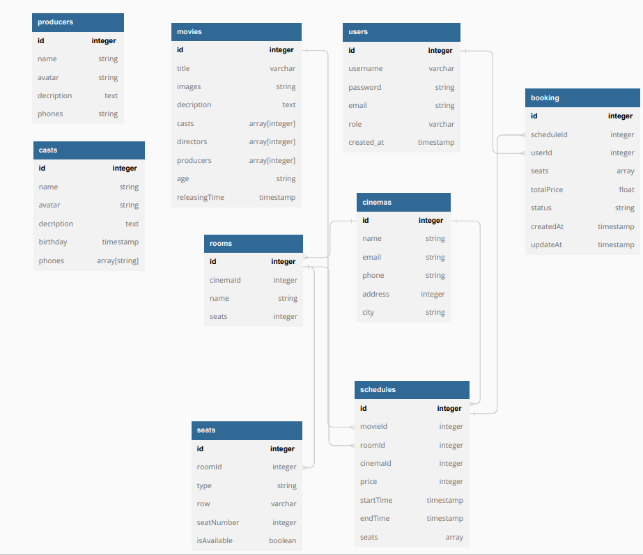

@NguyenLanDEV
<h3>1> Anh em nhớ tạo file env sang từ file .example.env</h3>
<h3> 2> Lưu token jwt và refreshToken sau khi anh em login vào headers authorization: accessToken, x-refresh-token: refreshToken</h3>
